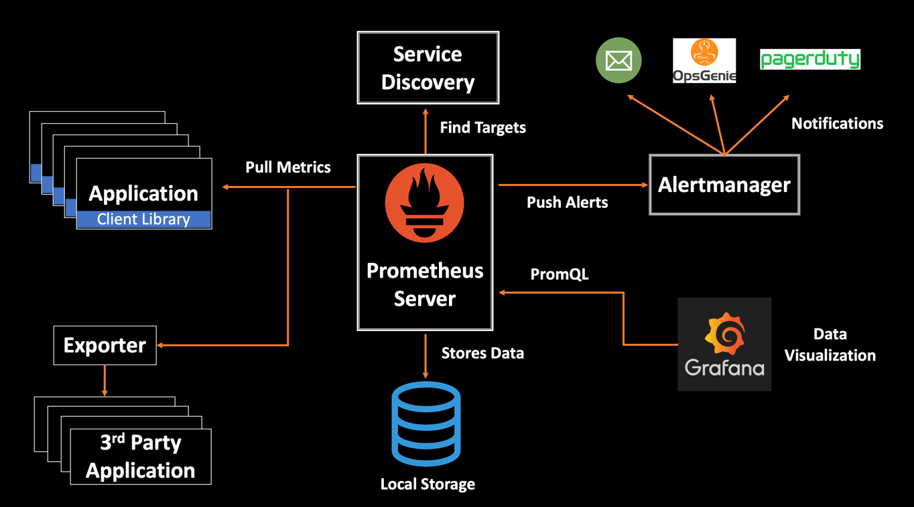
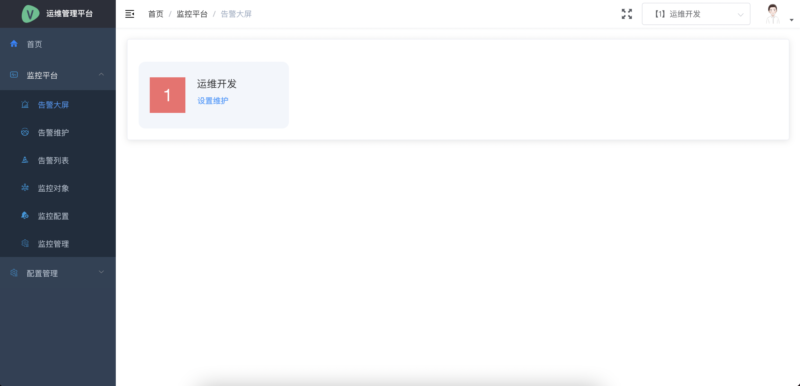
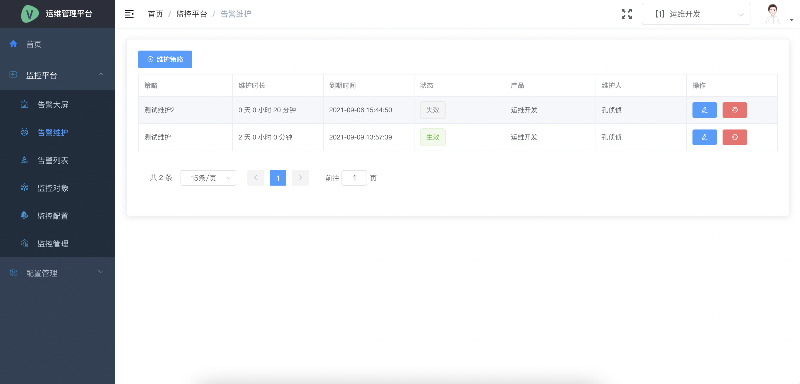
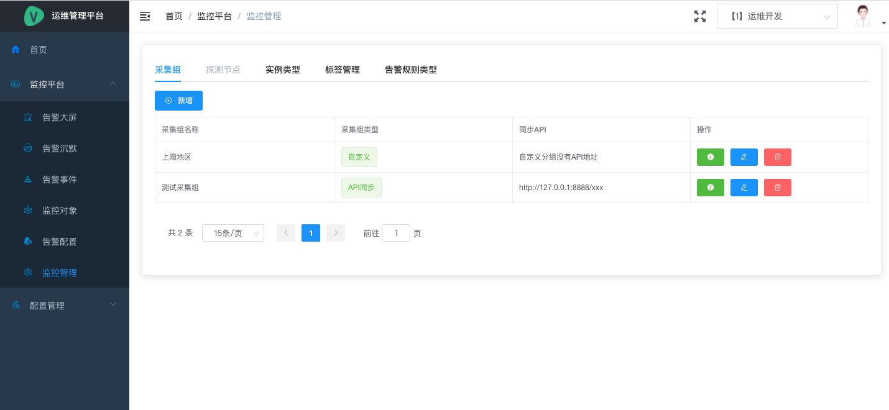

# 监控平台

::: tip
监控平台基于Prometheus + (Thanos) + AlertManager + Grafana开发
:::

## 技术栈

- 服务端 Django RestFramework
- 客户端 Go
- 代理端 Go
- 前端 Vue + Element

## 产品架构图



## 前端说明

### 监控大屏

::: tip
监控大屏，主要显示某个产品下的告警(告警数量)，具体的告警详情可以点击查看，也可以针对告警设置维护。
如图
:::



### 告警维护

::: tip
告警维护页面，显示的是告警维护的策略列表，可以查看具体的维护策略，可以看到维护策略是否正在生效中。
如图
:::



### 告警列表

> 显示当前正在告警的告警信息，和已经恢复的告警信息，目的是记录下历史的告警。
### 监控对象

> 本次版本目前只支持主机实例，后续会增加如MySQL、Redis、域名、kubernetes、探测功能等等。

### 告警配置

> 告警配置是监控平台的重点，主要有：配置告警规则，配置告警路由，配置告警通知对象，监控任务(Prometheus中的Jobs)的管理。 

#### 告警规则

> 告警规则是重点，首先我们理想的状态是同一类型的告警只会配置一条告警规则，如果有细分的情况，我们针对主告警规则添加一些子规则。

:tada: :100: 这条规则的意思是，所有目标实例离线，我们全局就只会配置这一条规则

```promql
up{} == 0
```

:bomb: 那么类似再加这一条规则就没有必要了

```promql
up{_ip="10.10.10.10"} == 0
```

#### 告警路由

> 告警路由就是将哪些告警发送给哪些人，我们定义每个产品下面都会有一条默认的兜底的告警路由，也就是这个产品下的所有告警都会发送给
> 这个产品的运维人员。当然，也可以在这个产品下配置子路由，子路由可以配置覆盖父路由，意思就是匹配到这个子路由的情况下，这条告警
> 就会发送给这个子路由中配置的通知人员。

> 告警路由最重要的点就是标签匹配

**父路由**：这条路由规则的意思就是所有运维开发的告警信息发送给谁
```promql
{_product_name="运维开发"}
```

**子路由**：这条路由规则的意思就是运维开发下的关于CPU负载高的告警信息发送给谁
```
{_product_name="运维开发", alertname="CPULoadHigh"}
```

#### 告警通知组

> 告警通知组，顾名思义就是接收告警信息的人员分组
#### 任务管理

> Prometheus配置文件中的scaped job, 就是抓取任务

#### 分组管理

> 圈定一部分机器, 将机器分组, 同时分组自带有分组标签, 同时分组中可配置抓取任务
> 
> [官方解释](https://prometheus.io/docs/prometheus/latest/configuration/configuration/#scrape_config)

### 监控管理


#### 采集组

> 监控的代理节点 会封装Prometheus 服务端的一些配置会下发到这些代理节点上

#### 实例类型

> 就是监控目标的类型 可以是机器 可以是数据库 可以是域名 可以是探测类型 等等
>
> 就是一些官方的exporter 比如你需要Ping测检测 那么就需要一个ping exporter部署在某台机器上 那么这个机器上的exporter启动的服务就是一个探测节点

#### 探测节点

> 比如Ping探测 或者域名探测 或者交换机探测 等等
#### 标签管理

> Prometheus很重要的一点就是标签 不同的PromQL包含标签
#### 告警规则类型管理

> 我们定义了一些告警规则类型 比如主机类型 比如MySQL类型 等等 就是为了在告警规则管理中能明显看出规则的类型而已

## 后端说明

## 客户端说明

### 主要功能

- 基础Node Exporter封装
- 端口监控
- 进程监控
- 脚本监控
- 服务发现

## 一些Exporter官方地址

- [Node exporter](https://github.com/prometheus/node_exporter)
- [Blackbox exporter](https://github.com/prometheus/blackbox_exporter)
- [MySQL Server Exporter](https://github.com/prometheus/mysqld_exporter)
- [Redis Metrics Exporter](https://github.com/oliver006/redis_exporter)
- [Exporter 列表](https://prometheus.io/docs/instrumenting/exporters/)

## 一些告警规则标准

- [Prometheus Alert Rule Example](https://awesome-prometheus-alerts.grep.to/)